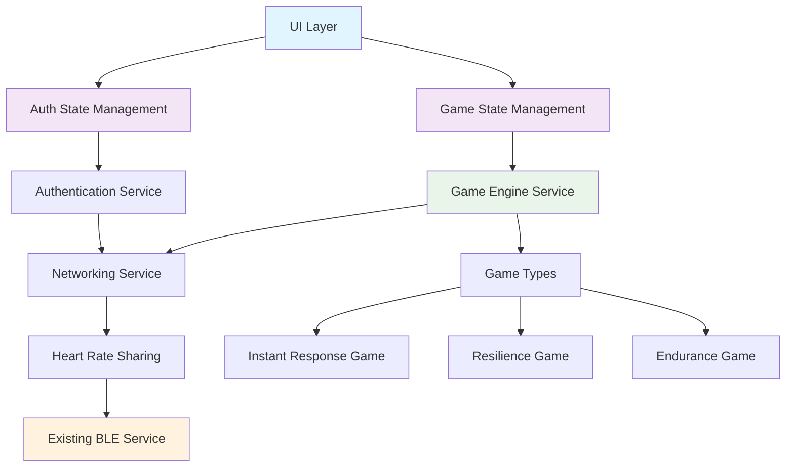

# Competitive Heart-Beat Gaming - Design Document

## Overview

The competitive heart-beat gaming feature extends the existing heart rate monitoring application with multiplayer capabilities, user authentication, and game-based challenges. The design leverages the current Provider-based state management, abstract BLE service architecture, and modular structure while adding new competitive, authentication, and networking layers.

The implementation follows the existing cross-platform approach, ensuring seamless operation across Android, Windows, and Web platforms while maintaining the current real-time heart rate monitoring capabilities as the foundation for competitive gameplay.

## Steering Document Alignment

### Technical Standards (tech.md)

The design adheres to the established technical patterns:
- **Factory Pattern**: Extends existing BLE service factory pattern for game service implementations
- **Provider Pattern**: Leverages existing ChangeNotifier providers for game state management
- **Cross-platform Architecture**: Maintains platform abstraction layer for networking services
- **Stream-based Architecture**: Extends current heart rate streams for multiplayer data sharing
- **Modular Design**: Follows established lib/ module organization with new competitive/ and auth/ modules

### Project Structure (structure.md)

Implementation follows the documented project organization:
- New modules integrate into existing lib/ structure
- Maintains separation of concerns between BLE, UI, and business logic
- Preserves existing Provider-based state management patterns
- Follows established error handling and platform abstraction strategies

## Code Reuse Analysis

### Existing Components to Leverage

- **BleService (lib/ble/)**: Core heart rate streaming functionality will be extended for multiplayer data broadcasting
- **HeartRateParser (lib/ble/)**: Data parsing logic reused for validating shared heart rate data
- **Provider Pattern (main.dart)**: Existing PlayerSettings and WorkoutSettings providers serve as templates for new GameSettings and AuthSettings providers
- **Cross-platform Structure**: Current platform detection and conditional imports pattern extended for networking services

### Integration Points

- **Main Application (lib/main.dart)**: MultiProvider setup extended to include authentication and game state providers
- **Heart Rate Stream**: Current BleService.heartRateStream integrated with multiplayer broadcasting
- **SharedPreferences**: Existing settings persistence extended for user authentication and game preferences
- **UI Architecture**: Current page-based navigation extended with new authentication and game lobby pages

## Architecture

The competitive gaming feature introduces three new architectural layers while preserving existing functionality:

### Modular Design Principles

- **Single File Responsibility**: Each authentication, networking, and game component isolated into focused files
- **Component Isolation**: Game types implemented as separate, pluggable classes inheriting from base game interfaces
- **Service Layer Separation**: Clear separation between authentication service, networking service, game engine, and UI layers
- **Utility Modularity**: Game logic, networking protocols, and validation utilities broken into focused, single-purpose modules



## Components and Interfaces

### Authentication Service (lib/auth/auth_service.dart)

- **Purpose:** Handle user registration, login, and session management
- **Interfaces:** 
  - `Future<AuthResult> register(String email, String username, String password)`
  - `Future<AuthResult> login(String email, String password)`
  - `Future<void> logout()`
  - `Stream<User?> get userStream`
- **Dependencies:** SharedPreferences for token storage, HTTP client for API communication
- **Reuses:** Existing settings persistence pattern from PlayerSettings

### Authentication State Provider (lib/auth/auth_settings.dart)

- **Purpose:** Manage authentication state across the application using Provider pattern
- **Interfaces:**
  - `User? get currentUser`
  - `bool get isAuthenticated`
  - `Future<void> login(String email, String password)`
  - `Future<void> logout()`
- **Dependencies:** AuthService, ChangeNotifier
- **Reuses:** Follows exact pattern of existing WorkoutSettings and PlayerSettings

### Networking Service (lib/competitive/networking_service.dart)

- **Purpose:** Handle real-time communication between players during competitive sessions
- **Interfaces:**
  - `Future<void> connect(String sessionCode)`
  - `Future<String> createSession()`
  - `Stream<List<PlayerData>> get playersStream`
  - `void broadcastHeartRate(int bpm)`
  - `Stream<GameEvent> get gameEventsStream`
- **Dependencies:** WebSocket connection, JSON serialization
- **Reuses:** Extends existing BLE service streaming pattern for multiplayer data

### Game Engine Service (lib/competitive/game_engine_service.dart)

- **Purpose:** Orchestrate game sessions, scoring, and win/lose determination
- **Interfaces:**
  - `Future<void> startGame(GameType type, GameConfig config)`
  - `Future<void> stopGame()`
  - `Stream<GameState> get gameStateStream`
  - `Stream<List<PlayerScore>> get scoresStream`
- **Dependencies:** NetworkingService, Timer for game timing
- **Reuses:** Integrates with existing heart rate stream from BleService

### Game State Provider (lib/competitive/game_settings.dart)

- **Purpose:** Manage competitive game state using Provider pattern
- **Interfaces:**
  - `GameSession? get currentSession`
  - `List<PlayerData> get connectedPlayers`
  - `GameState get currentGameState`
  - `void updateGameState(GameState state)`
- **Dependencies:** GameEngineService, NetworkingService, ChangeNotifier
- **Reuses:** Follows existing Provider state management pattern

### Base Game Type (lib/competitive/games/base_game.dart)

- **Purpose:** Abstract base class for all competitive game implementations
- **Interfaces:**
  - `abstract Future<void> initialize(GameConfig config)`
  - `abstract void processHeartRateUpdate(String playerId, int bpm)`
  - `abstract GameResult calculateResults()`
  - `Stream<GameUpdate> get gameUpdatesStream`
- **Dependencies:** Timer, StreamController
- **Reuses:** None - new base abstraction for game types

### Instant Response Game (lib/competitive/games/instant_response_game.dart)

- **Purpose:** Implement 瞬発力 (instant response) cardiovascular reactivity challenges
- **Interfaces:** Inherits from BaseGame, implements stimulus-response logic
- **Dependencies:** BaseGame, Random for stimulus generation
- **Reuses:** Heart rate change detection logic adapted from existing monitoring

### Resilience Game (lib/competitive/games/resilience_game.dart)

- **Purpose:** Implement heart rate stability challenges under stress conditions
- **Interfaces:** Inherits from BaseGame, implements stability scoring
- **Dependencies:** BaseGame, statistics calculations for stability metrics
- **Reuses:** Heart rate zone calculations from existing WorkoutConfig

### Endurance Game (lib/competitive/games/endurance_game.dart)

- **Purpose:** Implement sustained heart rate performance competitions
- **Interfaces:** Inherits from BaseGame, implements endurance scoring
- **Dependencies:** BaseGame, duration tracking, zone maintenance scoring
- **Reuses:** Existing heart rate zone logic from workout module

## Data Models

### User Model (lib/auth/models/user.dart)
```dart
class User {
  final String id;
  final String email;
  final String username;
  final DateTime createdAt;
  final UserProfile profile;
  
  User({
    required this.id,
    required this.email, 
    required this.username,
    required this.createdAt,
    required this.profile,
  });
}
```

### Player Data Model (lib/competitive/models/player_data.dart)
```dart
class PlayerData {
  final String id;
  final String username;
  final int currentHeartRate;
  final DateTime lastUpdate;
  final bool isConnected;
  final PlayerStatus status;
  
  PlayerData({
    required this.id,
    required this.username,
    required this.currentHeartRate,
    required this.lastUpdate,
    required this.isConnected,
    required this.status,
  });
}
```

### Game Session Model (lib/competitive/models/game_session.dart)
```dart
class GameSession {
  final String id;
  final String hostId;
  final List<String> playerIds;
  final GameType gameType;
  final GameState state;
  final DateTime createdAt;
  final GameConfig config;
  
  GameSession({
    required this.id,
    required this.hostId,
    required this.playerIds,
    required this.gameType,
    required this.state,
    required this.createdAt,
    required this.config,
  });
}
```

### Game Result Model (lib/competitive/models/game_result.dart)
```dart
class GameResult {
  final String sessionId;
  final List<PlayerScore> scores;
  final PlayerScore winner;
  final Duration gameDuration;
  final DateTime completedAt;
  final Map<String, dynamic> gameMetrics;
  
  GameResult({
    required this.sessionId,
    required this.scores,
    required this.winner,
    required this.gameDuration,
    required this.completedAt,
    required this.gameMetrics,
  });
}
```

## Error Handling

### Error Scenarios

1. **Authentication Failure**
   - **Handling:** Show user-friendly error messages, maintain offline mode access to individual monitoring
   - **User Impact:** Clear indication of login issues, graceful fallback to single-player mode

2. **Network Connection Loss During Game**
   - **Handling:** Pause game state, attempt automatic reconnection with exponential backoff, preserve game progress
   - **User Impact:** Game paused notification, reconnection status indicator, option to continue when connection restored

3. **Heart Rate Sensor Disconnection During Competitive Session**
   - **Handling:** Notify other players, provide reconnection grace period, exclude player from current round if needed
   - **User Impact:** Clear status indication, guided reconnection process, fair game continuation for other players

4. **Invalid Game Session Codes**
   - **Handling:** Validate session codes before connection attempts, provide clear error feedback
   - **User Impact:** Immediate feedback on invalid codes, suggestions for troubleshooting

5. **Game Synchronization Issues**
   - **Handling:** Implement conflict resolution for game state mismatches, use authoritative server approach
   - **User Impact:** Transparent synchronization, minimal game disruption

## Testing Strategy

### Unit Testing

- **Authentication Service:** Test login/logout flows, token management, user state persistence
- **Game Engine Logic:** Test scoring algorithms, win/lose determination, game timing mechanisms
- **Networking Protocol:** Test message serialization, connection handling, data validation
- **Heart Rate Integration:** Test multiplayer heart rate broadcasting, data accuracy, synchronization

### Integration Testing

- **End-to-End Game Flow:** Test complete game sessions from lobby creation to results display
- **Cross-platform Networking:** Validate communication between different platform clients
- **BLE Integration:** Test heart rate sharing with existing BLE service integration
- **State Management:** Test Provider state updates across authentication and game state changes

### End-to-End Testing

- **Complete User Journey:** Registration → Login → Session Creation → Game Play → Results
- **Multiplayer Scenarios:** Multiple users joining sessions, concurrent game participation
- **Error Recovery:** Network interruptions, sensor disconnections, app backgrounding during games
- **Platform Compatibility:** Identical functionality across Android, Windows, and Web platforms

The design maintains backward compatibility with existing functionality while providing a robust foundation for competitive heart rate gaming. All new components follow established architectural patterns and integrate seamlessly with the current Provider-based state management and modular structure.