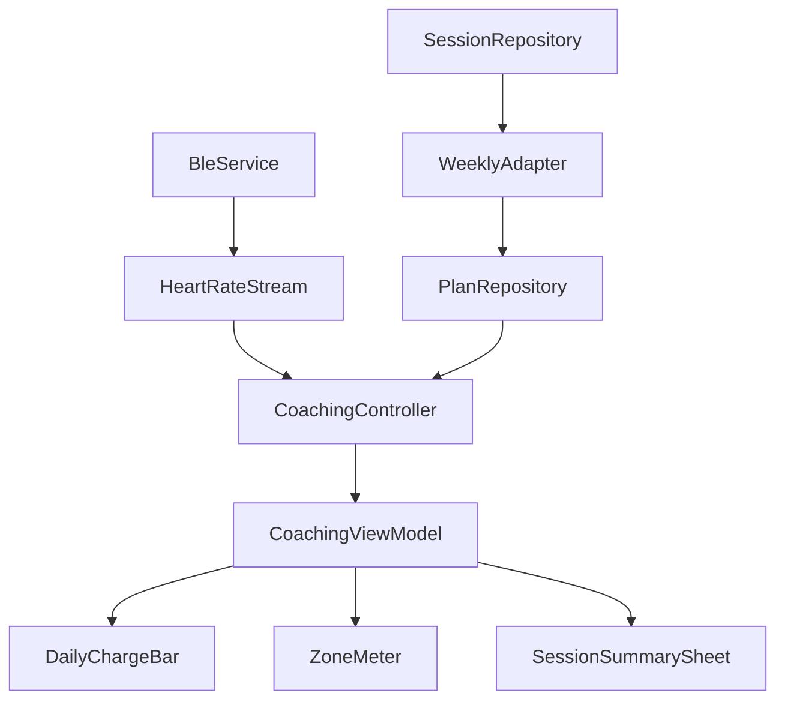

# Design Document — Frontend Rebuild for Adaptive Heart Rate Coach

## Overview
Implement an adaptive coaching frontend in Flutter that layers Daily Charge progress, real-time zone cues, and weekly adaptations over the existing BLE pipeline. The design keeps BLE and parsing untouched, adds Riverpod-driven coaching state, and introduces new UI widgets for glanceable guidance.

## Steering Document Alignment

### Technical Standards (tech.md)
- Use `flutter_riverpod` for state, `BleService` as abstraction, and local storage via Isar/Drift + SharedPreferences.
- Maintain 60 FPS, <300 ms zone cue latency, and on-device data handling.
- Respect Android BLE permission flows and reconnection resilience.

### Project Structure (structure.md)
- Place coaching widgets in `lib/workout/` (`daily_charge_bar.dart`, `zone_meter.dart`, `session_summary_sheet.dart`).
- Keep BLE in `lib/ble/`, reuse existing `BleService` and `heart_rate_parser`.
- Persist plans/sessions in a dedicated repository layer under `lib/workout/`.

## Code Reuse Analysis
- **BleService / heart_rate_parser**: Consume live BPM stream without modification.
- **Workout settings/profile**: Extend to hold target zones and user inputs (age, RHR).
- **Error/logging**: Reuse structured logging for connection and permission flows.

### Existing Components to Leverage
- **BleService**: Source of BPM stream and connection status.
- **WorkoutSettings**: Seed defaults and preferences.
- **Localization**: Japanese strings foundation; extend for new cues.

### Integration Points
- **BLE pipeline**: Subscribe to `heartRateStream` for zone cue calculation.
- **Persistence**: Store DailyPlan, Session, RPE, and WeeklyReport via Isar/Drift; lightweight settings via SharedPreferences.
- **UI routing**: Surface coaching UI on main monitoring screen; weekly report reachable from summary CTA.

## Architecture
Riverpod orchestrates BLE data → coaching logic → UI. A coaching controller computes zone cues, tracks minutes-in-zone, and emits display models consumed by widgets. Persistence repositories store plans and completed sessions; a weekly adapter updates next-week targets.

### Modular Design Principles
- Single responsibility per file (widget, controller, repository, model).
- Component isolation for visual pieces (DailyChargeBar, ZoneMeter, SessionSummarySheet).
- Service separation: BLE service, coaching logic, persistence repositories.
- Utility modularity: shared color semantics and animation helpers.



## Components and Interfaces

### CoachingController (StateNotifier)
- **Purpose:** Compute zone cue, accumulate minutes in zone, expose view model.
- **Interfaces:** `state` (CoachingState), `onHeartRate(int bpm)`, `startSession(plan)`, `endSession(rpe)`.
- **Dependencies:** `BleService`, `PlanRepository`, `SessionRepository`, `Ticker/Timer`.
- **Reuses:** `heart_rate_parser` output; existing logging.

### DailyChargeBar (Widget)
- **Purpose:** Render daily progress toward target minutes.
- **Interfaces:** Props: `achievedMinutes`, `targetMinutes`, `isPaused`, `gapNotice`.
- **Dependencies:** `CoachingViewModel` provider.
- **Reuses:** Shared color/animation tokens.

### ZoneMeter (Widget)
- **Purpose:** Show UP/KEEP/DOWN cues with color semantics and pulse animation.
- **Interfaces:** Props: `cue`, `bpm`, `targetRange`.
- **Dependencies:** `CoachingViewModel` provider.
- **Reuses:** Animation helpers.

### SessionSummarySheet (Widget)
- **Purpose:** Present end-of-session metrics and capture RPE (required).
- **Interfaces:** Props: `SessionMetrics`, callback `onSubmitRpe(int rpe)`.
- **Dependencies:** `SessionRepository`, `CoachingController`.
- **Reuses:** Localization strings.

### WeeklyAdapter (Service)
- **Purpose:** Compute next-week plan based on completion and RPE.
- **Interfaces:** `computeNextWeek(weekData) -> PlanDelta`.
- **Dependencies:** `SessionRepository`, `PlanRepository`.
- **Reuses:** Calculation helpers (Karvonen/Tanaka).

## Bar-Style UI Layout (Glanceable Coach Surface)
- **Top: Daily Charge Bar** — full-width horizontal bar; label “X / Y mins today”; fill animates as minutes-in-zone accrue; paused/reconnecting overlays; gap indicator on reconnect.
- **Middle: Zone Meter** — vertical or wide horizontal band with needle/marker; color semantics: blue (UP), green→orange gradient (KEEP), red (DOWN); cue text “UP ↑ / KEEP ⟷ / DOWN ↓”; shows current BPM and target range.
- **Bottom: Action & Status Row** — large buttons [START]/[PAUSE]/[STOP] with inline status (connecting/reconnecting/error); concise state messages.
- **Session Summary (Modal/Sheet)** — after stop: metrics (time in zone, avg/max BPM), target vs achieved, RPE required input (1–10), save CTA; “RPE missing” banner if skipped.
- **Weekly Report (Secondary Surface)** — completion %, avg RPE, recommended adjustment (+10%/hold/regress), CTA to accept next-week plan.

## Data Models

### DailyPlan
```
class DailyPlan {
  DateTime date;
  int targetMinutes;
  int targetLowerBpm;
  int targetUpperBpm;
  bool completed;
}
```

### CoachingState (view model)
```
class CoachingState {
  int currentBpm;
  int achievedMinutes;
  int targetMinutes;
  int targetLowerBpm;
  int targetUpperBpm;
  ZoneCue cue; // up | keep | down
  bool paused;
  bool reconnecting;
  Duration lastSampleAgo;
}
```

### SessionRecord
```
class SessionRecord {
  String id;
  DateTime start;
  DateTime end;
  int avgBpm;
  int maxBpm;
  int minutesInZone;
  int? rpe; // required; null flags missing
}
```

### WeeklyReport
```
class WeeklyReport {
  int plannedMinutes;
  int achievedMinutes;
  double avgRpe;
  PlanDelta delta;
}
```

## Error Handling

### Error Scenarios
1. **Permission Denied (Android 12+)**
   - **Handling:** Gate start; prompt for `BLUETOOTH_SCAN/CONNECT`; log and retry after grant.
   - **User Impact:** Inline banner with action button; session cannot start until resolved.
2. **Connection Lost Mid-Session**
   - **Handling:** Exponential backoff reconnect (up to 8 attempts); pause accumulation; show gap notice.
   - **User Impact:** Banner + paused Daily Charge; auto resume on success.
3. **Missing RPE on Session End**
   - **Handling:** Persist session as “RPE missing”; re-prompt once before leaving screen.
   - **User Impact:** Non-blocking toast + action to add RPE.
4. **Invalid BPM Sample (<20 or >300)**
   - **Handling:** Drop sample, emit warning log, do not update cue/minutes.
   - **User Impact:** No visible change; maintain last valid cue.

## Testing Strategy

### Unit Testing
- CoachingController: cue logic, minute accumulation, day rollover reset.
- WeeklyAdapter: progression/hold/regress rules.
- Parsers/validators: BPM range filtering, target zone calculations.

### Integration Testing
- BLE stream → coaching state → widget bindings (using mock BleService).
- Permission flows on Android variants; reconnection behavior.
- Session end → summary → RPE persistence → weekly computation.

### End-to-End Testing
- Happy path: connect sensor, stay in zone, see UP/KEEP/DOWN cues, complete session with RPE.
- Edge: connection drop mid-session, reconnection, gap notice.
- Weekly roll: simulate a week of sessions to verify progression/regression of targets.
