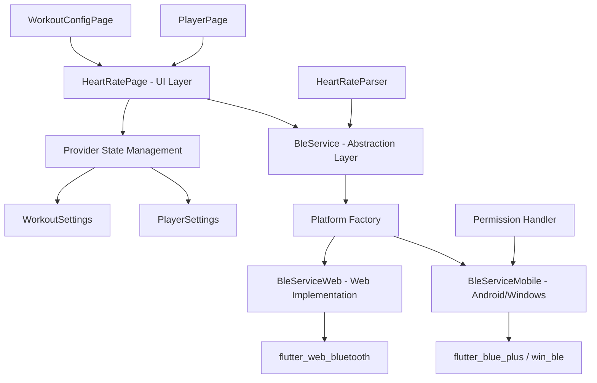

# Heart Rate Monitoring System - Design Document

## Overview

The Heart Rate Monitoring System implements a cross-platform Flutter application with a modular architecture that abstracts platform-specific Bluetooth Low Energy (BLE) implementations behind a unified service interface. The system is designed around the factory pattern for platform abstraction, provider pattern for state management, and stream-based architecture for real-time data processing.

The design leverages existing Flutter cross-platform capabilities while providing native-level BLE performance through platform-specific implementations, ensuring optimal user experience across Android, Windows, and Web environments.

## Steering Document Alignment

### Technical Standards (tech.md)

The design follows documented technical patterns:

- **Platform Abstraction**: Uses factory pattern with abstract BleService interface and platform-specific implementations
- **State Management**: Implements Provider pattern for settings and workout configuration management
- **Modular Architecture**: Separates concerns across BLE, UI, player, and workout modules
- **Performance Optimization**: Maintains real-time requirements with 200ms data processing and 60 FPS UI
- **Cross-platform Compatibility**: Supports Android (flutter_blue_plus), Windows (win_ble), and Web (flutter_web_bluetooth)

### Project Structure (structure.md)

Implementation follows established project organization:

- **lib/ble/**: BLE module with service abstractions and platform implementations
- **lib/player/**: Media player functionality with heart rate integration
- **lib/workout/**: Training configuration and user profile management
- **lib/main.dart**: Application bootstrap with provider setup
- **Platform directories**: Android, Windows, Web, iOS, macOS, Linux configurations

## Code Reuse Analysis

### Existing Components to Leverage

- **BleService Factory**: Already implements platform detection and appropriate implementation selection
- **HeartRateParser**: Existing data parsing logic for both 8-bit and 16-bit heart rate formats
- **Provider State Management**: PlayerSettings and WorkoutSettings already implemented for persistence
- **Permission Handling**: Android-specific BLE permission management already in place
- **Stream Architecture**: Real-time heart rate data streaming already functional

### Integration Points

- **SharedPreferences**: Existing settings persistence system for workout configurations and player settings
- **Flutter WebView**: Existing YouTube player integration with flutter_inappwebview
- **Platform Channels**: Native BLE backends already integrated through plugin system
- **Material Design**: Existing UI theme and component structure

## Architecture

The system implements a layered architecture with clear separation of concerns:



### Modular Design Principles

- **Single File Responsibility**: Each BLE implementation handles one platform, parser handles only data conversion
- **Component Isolation**: BLE service isolated from UI, settings management separate from data processing
- **Service Layer Separation**: BLE abstraction layer separates platform specifics from business logic
- **Utility Modularity**: HeartRateParser as focused, single-purpose data processing utility

## Components and Interfaces

### BleService (Abstract Interface)
- **Purpose:** Provides unified interface for cross-platform BLE heart rate sensor communication
- **Interfaces:** 
  - `Stream<int> get heartRateStream`: Real-time heart rate data stream
  - `Future<void> initializeIfNeeded()`: Platform-specific initialization
  - `Future<DeviceInfo?> scanAndConnect()`: Device discovery and connection
  - `Future<void> disconnect()`: Connection cleanup
- **Dependencies:** Platform-specific implementations
- **Reuses:** Existing factory pattern implementation

### BleServiceImplMobile (Mobile/Desktop Implementation)
- **Purpose:** Handles BLE communication for Android and Windows platforms
- **Interfaces:** Implements BleService abstract methods
- **Dependencies:** flutter_blue_plus, win_ble, permission_handler
- **Reuses:** Existing permission handling and native plugin integration

### BleServiceImplWeb (Web Implementation)
- **Purpose:** Handles BLE communication for web browsers using Web Bluetooth API
- **Interfaces:** Implements BleService abstract methods
- **Dependencies:** flutter_web_bluetooth
- **Reuses:** Existing web platform detection logic

### HeartRateParser (Data Processing Utility)
- **Purpose:** Parses raw BLE heart rate measurement data according to Bluetooth specification
- **Interfaces:** 
  - `static int parseHeartRate(List<int> data)`: Converts raw bytes to BPM value
- **Dependencies:** None (pure utility)
- **Reuses:** Existing parsing logic for 8-bit and 16-bit formats

### HeartRatePage (Main UI Component)
- **Purpose:** Primary interface displaying real-time heart rate and connection controls
- **Interfaces:** StatefulWidget with stream subscription management
- **Dependencies:** BleService, WorkoutSettings provider, navigation system
- **Reuses:** Existing provider integration and Material Design components

### PlayerSettings (State Management)
- **Purpose:** Manages YouTube player preferences and configurations
- **Interfaces:** ChangeNotifier with SharedPreferences persistence
- **Dependencies:** shared_preferences
- **Reuses:** Existing provider pattern implementation

### WorkoutSettings (State Management)
- **Purpose:** Manages workout configurations and training profiles
- **Interfaces:** ChangeNotifier with persistent storage
- **Dependencies:** shared_preferences
- **Reuses:** Existing settings persistence architecture

## Data Models

### DeviceInfo
```dart
class DeviceInfo {
  final String id;              // BLE device identifier
  final String platformName;    // Human-readable device name
  final String? manufacturerData; // Optional manufacturer information
  final int? rssi;             // Signal strength indicator
}
```

### WorkoutConfig
```dart
class WorkoutConfig {
  final String name;           // Configuration name (e.g., "Fat Burn", "Cardio")
  final int minHeartRate;      // Minimum target heart rate
  final int maxHeartRate;      // Maximum target heart rate
  final Duration duration;     // Workout duration
  final String description;    // User-friendly description
}
```

### BleConnectionState
```dart
enum BleConnectionState {
  idle,          // Not connected, ready to scan
  scanning,      // Actively scanning for devices
  connecting,    // Attempting to connect to device
  connected,     // Successfully connected and streaming
  disconnected,  // Previously connected, now disconnected
  error         // Error state requiring user intervention
}
```

## Error Handling

### Error Scenarios

1. **BLE Permission Denied (Android)**
   - **Handling:** Check permissions on startup, request if needed, graceful degradation
   - **User Impact:** Display "権限が拒否されました" message with guidance to enable permissions

2. **Device Not Found During Scan**
   - **Handling:** Timeout after reasonable scanning period, clear scan results
   - **User Impact:** Display "デバイス未検出" status with retry option

3. **Connection Failure**
   - **Handling:** Implement exponential backoff retry logic, maintain last known state
   - **User Impact:** Show connection attempt status, maintain last known BPM display

4. **Platform BLE Not Supported**
   - **Handling:** Platform detection with fallback to error state
   - **User Impact:** Clear message indicating BLE requirements and supported platforms

5. **Malformed Heart Rate Data**
   - **Handling:** Data validation in HeartRateParser, skip invalid packets
   - **User Impact:** Continue displaying last valid BPM, no visible error to user

6. **Stream Subscription Errors**
   - **Handling:** Automatic stream restart with connection recovery
   - **User Impact:** Brief interruption in data updates, automatic recovery

## Testing Strategy

### Unit Testing

- **HeartRateParser**: Test data parsing with various formats (8-bit, 16-bit, malformed data)
- **WorkoutSettings**: Test configuration persistence and state management
- **PlayerSettings**: Test settings storage and retrieval
- **Platform Detection**: Test factory pattern device type selection

### Integration Testing

- **BLE Service Integration**: Mock BLE devices for connection flow testing
- **Permission Flow**: Test Android permission request and handling sequences
- **State Management**: Test provider pattern integration with UI updates
- **Cross-platform**: Test platform-specific implementations with mock backends

### End-to-End Testing

- **Device Connection Workflow**: Full scan → connect → stream → disconnect cycle
- **Real-time Data Display**: Heart rate sensor to UI display pipeline
- **YouTube Integration**: Heart rate overlay during video playback
- **Settings Persistence**: Configuration changes across app restarts
- **Error Recovery**: Connection loss and automatic reconnection scenarios

## Implementation Considerations

### Performance Optimizations

- **Stream Management**: Single subscription model to prevent memory leaks
- **UI Updates**: Throttled updates to maintain 60 FPS during rapid data changes
- **Battery Efficiency**: Optimized scanning intervals and connection management
- **Memory Usage**: Minimal buffering and automatic cleanup of unused resources

### Security Measures

- **Local Processing**: All heart rate data processed locally, no external transmission
- **Permission Scope**: Request only necessary BLE and location permissions
- **Data Validation**: Comprehensive input validation for all BLE data packets
- **Secure Storage**: Settings encrypted using Flutter secure storage patterns

### Scalability Provisions

- **Multi-device Support**: Architecture ready for multiple simultaneous BLE connections
- **Plugin Extensions**: Modular design allows easy addition of new sensor types
- **Cloud Integration**: Optional analytics and sync capabilities can be added
- **Advanced Analytics**: Foundation for heart rate zone calculations and training insights